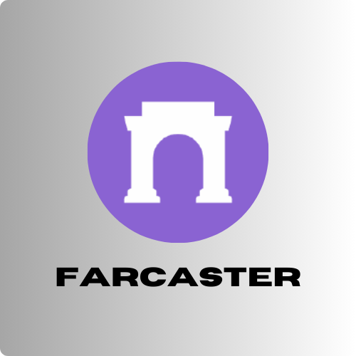

<h1 align="center">NodeInter</h1>
<h3 align="center">Operator node and validator</h3>

<h4 align="center">NodeInter is an Independent Node and validator, contributing to Cosmos Ecosystem and various other blockchain network, offering valuable data analytics, scripting tools & services that have earned recognition from prominent crypto projects. NodeInter mission is to participate in building and being involved in a blockchain project, and helping a project reach the milestones they are targeting.
</h4>

 

  

- 🔭 I’m currently working on [Initia Network](https://initia.xyz/)

- 👯 I’m looking to collaborate on [Movement Labs](https://movementlabs.xyz/)

- 🤝 I’m looking for help with [Initia Network](https://initia.xyz/)

- 📝 I regularly write articles on [nodeinter.net](nodeinter.net)

- 📫 How to reach me **nodeinter@gmail.com**

 

 <h2 align="center">⚒️ Languages-Frameworks-Tools ⚒️</h2>
 
      

<h3 align="center"> 🔴 VALIDATOR NODES HISTORY 🔴</h3>

<h3 align="left">Connect with me:</h3>

  
